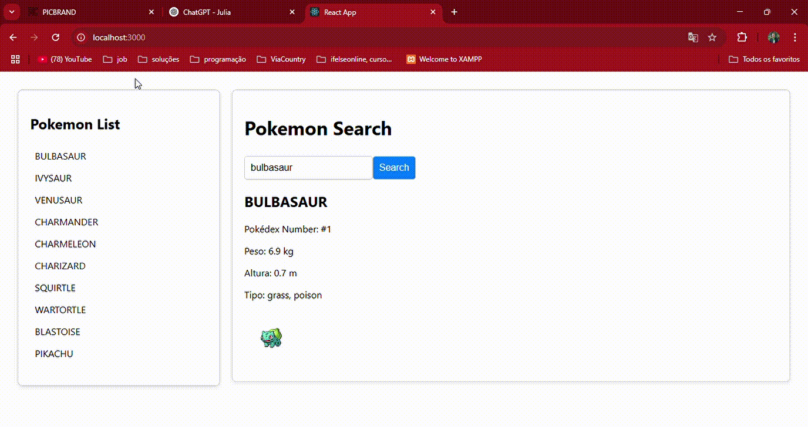

# Pokedex App

Bem-vindo ao **Pokedex App**, uma aplicação web desenvolvida com React que permite aos usuários pesquisar e explorar informações detalhadas sobre seus Pokémons favoritos. Utilizando a API do Pokedex, nossa aplicação oferece uma interface amigável e responsiva, perfeita para entusiastas e fãs de Pokémon de todas as idades.

## Funcionalidades

- **Pesquisa Dinâmica**: Busque Pokémons pelo nome ou número no Pokedex.
- **Top 10 Pokémons**: Explore uma lista dos 10 principais Pokémons, selecionados com base em sua popularidade e poder.
- **Informações Detalhadas**: Acesse detalhes como tipo, habilidades e estatísticas base de cada Pokémon.
- **Interface Responsiva**: Desfrute de uma experiência de usuário otimizada tanto em dispositivos móveis quanto em desktops.

## Tecnologias Utilizadas

- **React**: Para construção da interface de usuário dinâmica.
- **Pokedex API**: Para obtenção dos dados dos Pokémons.
- **CSS**: Para estilização personalizada e responsiva.

## veja um pouco da aplicação
Acesse a aplicação ao clicar no link abaixo e veja como ela funciona:

[**Pokedex App**](https://project-pokedex-gilt.vercel.app)

## Acesso Online

A aplicação pode ser acessada através do link abaixo:

[Visite Pokedex App](coloque-aqui-o-link)

